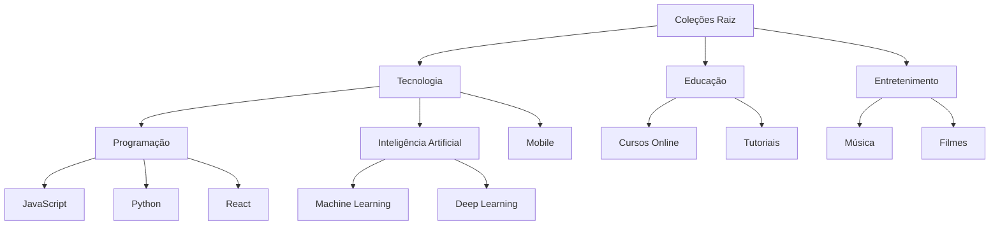
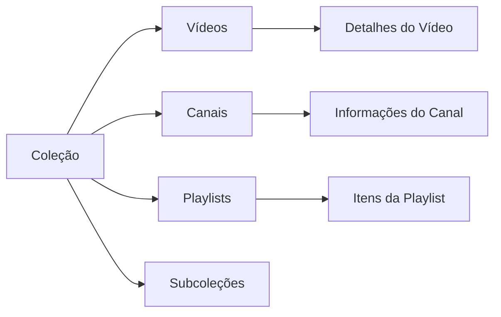

# Collections Architecture Design for YouTube Organizer

## Overview

Collections will replace the current categories and tags system, providing a flexible hierarchical organization that can contain videos, channels, playlists, and other collections.

## Modelo de Dados Hierárquico

### 1. Modelo Principal: Collection

```typescript
model Collection {
  id          String   @id @default(cuid())
  name        String
  description String?
  icon        String?  // URL do ícone personalizado ou nome do ícone do pacote
  color       String?  // Cor personalizada para UI (hex)
  isPublic    Boolean  @default(false) // Coleção compartilhada
  parentId    String?  // Para hierarquia (self-referencing)
  position    Int      @default(0) // Ordem de exibição
  userId      String
  createdAt   DateTime @default(now())
  updatedAt   DateTime @updatedAt

  // Relações
  parent      Collection?  @relation("CollectionHierarchy", fields: [parentId], references: [id])
  children    Collection[] @relation("CollectionHierarchy")
  
  // Conteúdo da coleção
  videos      CollectionVideo[]
  channels    CollectionChannel[]
  playlists   CollectionPlaylist[]
  
  // Tags e metadados
  tags        CollectionTag[]
  
  // Configurações
  settings    CollectionSettings?
  
  // Restrições
  @@unique([userId, name])
  @@index([parentId])
}
```

### 2. Modelo de Conteúdo da Coleção

```typescript
// Vídeos na coleção
model CollectionVideo {
  id          String   @id @default(cuid())
  collectionId String
  videoId     String
  addedAt     DateTime @default(now())
  position    Int      @default(0)
  notes       String?
  isWatched   Boolean  @default(false)
  rating      Int?     // 1-5 estrelas
  
  collection  Collection @relation(fields: [collectionId], references: [id], onDelete: Cascade)
  video       Video      @relation(fields: [videoId], references: [id], onDelete: Cascade)
  
  @@unique([collectionId, videoId])
  @@index([collectionId])
}

// Canais na coleção
model CollectionChannel {
  id          String   @id @default(cuid())
  collectionId String
  channelId   String   // YouTube channel ID
  channelTitle String?
  addedAt     DateTime @default(now())
  position    Int      @default(0)
  isSubscribed Boolean  @default(false)
  notifyNewVideos Boolean @default(false)
  
  collection  Collection @relation(fields: [collectionId], references: [id], onDelete: Cascade)
  
  @@unique([collectionId, channelId])
  @@index([collectionId])
}

// Playlists na coleção
model CollectionPlaylist {
  id          String   @id @default(cuid())
  collectionId String
  playlistId  String   // YouTube playlist ID
  playlistTitle String?
  addedAt     DateTime @default(now())
  position    Int      @default(0)
  
  collection  Collection @relation(fields: [collectionId], references: [id], onDelete: Cascade)
  
  @@unique([collectionId, playlistId])
  @@index([collectionId])
}
```

### 3. Modelo de Tags para Coleções

```typescript
// Tags globais do sistema
model Tag {
  id        String   @id @default(cuid())
  name      String
  color     String?  // Cor da tag
  userId    String
  createdAt DateTime @default(now())
  updatedAt DateTime @updatedAt
  
  // Relações
  collections CollectionTag[]
  
  @@unique([userId, name])
}

// Tags associadas a coleções
model CollectionTag {
  id          String   @id @default(cuid())
  collectionId String
  tagId       String
  addedAt     DateTime @default(now())
  
  collection  Collection @relation(fields: [collectionId], references: [id], onDelete: Cascade)
  tag         Tag        @relation(fields: [tagId], references: [id], onDelete: Cascade)
  
  @@unique([collectionId, tagId])
  @@index([collectionId])
  @@index([tagId])
}
```

### 4. Modelo de Configurações da Coleção

```typescript
model CollectionSettings {
  id               String   @id @default(cuid())
  collectionId     String   @unique
  autoTagging      Boolean  @default(false) // Geração automática de tags
  hideWatched       Boolean  @default(false) // Esconder vídeos assistidos
  hideShorts       Boolean  @default(false) // Esconder vídeos Shorts
  sortBy           String   @default("addedAt") // addedAt, publishedAt, title, duration
  sortOrder        String   @default("desc") // asc, desc
  maxVideos        Int?     // Limite máximo de vídeos
  customFeed       Boolean  @default(false) // Habilitar feed personalizado
  notifications    Boolean  @default(false) // Notificações de novos vídeos
  syncEnabled      Boolean  @default(false) // Sincronização automática
  
  collection       Collection @relation(fields: [collectionId], references: [id], onDelete: Cascade)
}
```

## Fluxo de Dados

### Hierarquia de Coleções



### Relacionamento com Conteúdo



## API Endpoints

### Coleções
- `GET /api/collections` - Listar coleções
- `POST /api/collections` - Criar coleção
- `GET /api/collections/[id]` - Obter coleção
- `PUT /api/collections/[id]` - Atualizar coleção
- `DELETE /api/collections/[id]` - Deletar coleção
- `POST /api/collections/[id]/items` - Adicionar item à coleção
- `DELETE /api/collections/[id]/items/[type]/[itemId]` - Remover item da coleção

### Conteúdo da Coleção
- `GET /api/collections/[id]/videos` - Listar vídeos da coleção
- `GET /api/collections/[id]/channels` - Listar canais da coleção
- `GET /api/collections/[id]/playlists` - Listar playlists da coleção
- `GET /api/collections/[id]/feed` - Feed de vídeos da coleção

### Tags
- `GET /api/tags` - Listar tags
- `POST /api/tags` - Criar tag
- `GET /api/collections/[id]/tags` - Listar tags da coleção
- `POST /api/collections/[id]/tags` - Adicionar tag à coleção

## Componentes React

### Principais Componentes
1. `CollectionTree` - Árvore hierárquica de coleções
2. `CollectionGrid` - Grade de coleções com visualização em cards
3. `CollectionItem` - Item individual da coleção
4. `CollectionSettings` - Configurações da coleção
5. `DragDropContext` - Contexto para arrastar e soltar
6. `CollectionFeed` - Feed de vídeos da coleção

### Estados Gerenciados
- Coleções hierárquicas
- Itens selecionados para arrastar
- Modo de edição
- Filtros e buscas
- Configurações de sincronização

## Funcionalidades Chave

### 1. Organização Hierárquica
- Coleções podem conter outras coleções
- Profundidade ilimitada (com limite prático)
- Arrastar e soltar para reorganizar

### 2. Múltiplos Tipos de Conteúdo
- Vídeos individuais
- Canais do YouTube
- Playlists do YouTube
- Mistura de todos os tipos

### 3. Tags Automáticas
- Análise de conteúdo para sugestão de tags
- Tags baseadas em título, descrição e categorias do YouTube
- Tags aprendidas com o uso do sistema

### 4. Sincronização
- Sincronização entre dispositivos
- Backup e restauração
- Exportação/importação de dados

### 5. Interface Intuitiva
- Visualização em árvore e grade
- Arrastar e soltar
- Busca e filtragem avançada
- Ícones personalizados

## Migração de Dados

### De Categorias/Tags para Coleções
1. Manter compatibilidade com sistema existente
2. Criar coleções baseadas em categorias atuais
3. Converter tags para tags globais
4. Associar conteúdo existente às novas coleções

### Estratégia de Migração
```sql
-- Exemplo de migração
INSERT INTO Collection (name, description, userId, createdAt, updatedAt)
SELECT name, description, userId, createdAt, updatedAt
FROM Category;

-- Associar vídeos às coleções
INSERT INTO CollectionVideo (collectionId, videoId, addedAt)
SELECT c.id, v.id, NOW()
FROM Category cat
JOIN Collection c ON cat.name = c.name AND cat.userId = c.userId
JOIN VideoCategory vc ON cat.id = vc.categoryId
JOIN Video v ON vc.videoId = v.id;
```

## Considerações de Desempenho

1. **Índices**: Índices em campos de busca e relacionamentos
2. **Paginação**: Coleções grandes devem ser paginadas
3. **Cache**: Cache de coleções e feeds
4. **Busca**: Indexação de texto para busca avançada
5. **Sincronização**: Processamento assíncrono para operações pesadas

## Segurança

1. **Acesso por Usuário**: Todas as coleções são vinculadas a usuários
2. **Permissões**: Coleções podem ser públicas ou privadas
3. **Validação**: Validação de entrada para todos os endpoints
4. **Rate Limiting**: Limitação de requisições para APIs

Este design fornece uma base sólida para implementar um sistema de coleções poderoso e flexível que substituirá o sistema atual de categorias e tags.