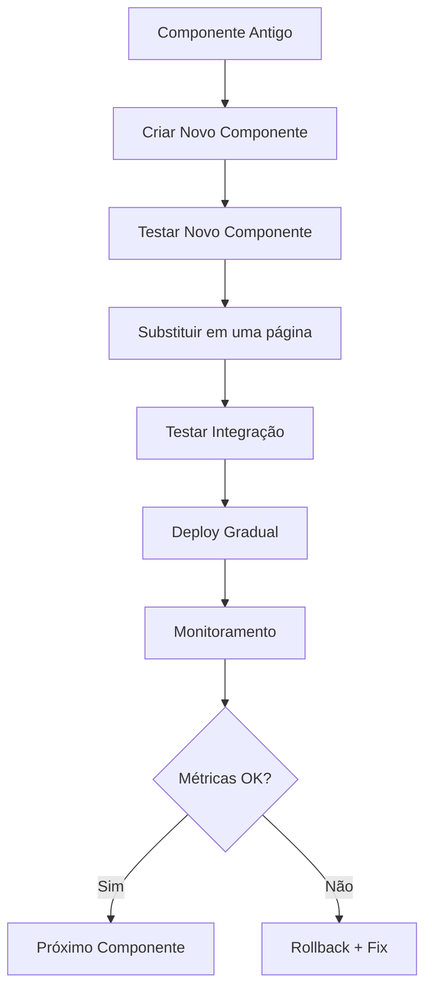

# 🚀 Plano de Migração - Reformulação YouTube Organizer

## 📋 Visão Geral

Este documento detalha o plano de migração para reformulação completa da aplicação YouTube Organizer com Design System unificado baseado em Tailwind CSS v4.

## 🎯 Objetivos da Migração

### Principais Metas
- **Consistência Visual**: Padrões unificados em toda aplicação
- **Manutenibilidade**: Código mais organizado e reutilizável
- **Performance**: Otimização de carregamento e renderização
- **Acessibilidade**: Conformidade com WCAG 2.1 AA
- **Escalabilidade**: Arquitetura preparada para crescimento

### Métricas de Sucesso
- ✅ **Coverage de Testes**: > 80%
- ✅ **Performance**: Lighthouse > 90
- ✅ **Acessibilidade**: WCAG 2.1 AA compliant
- ✅ **Consistência**: 100% dos componentes seguindo padrões

## 📅 Cronograma de Migração

### Fase 1: Foundation (Semanas 1-2)
**Data**: Janeiro 2025
**Duração**: 2 semanas
**Status**: ✅ Concluído

#### Atividades
1. ✅ **Criar sistema de tokens CSS**
   - Definir variáveis CSS customizadas
   - Implementar paleta de cores
   - Configurar tipografia e espaçamentos

2. ✅ **Implementar componentes base**
   - Button system com variants
   - Card system responsivo
   - Input system padronizado

3. ✅ **Criar layout system**
   - Container responsivo
   - Grid system flexível
   - Flexbox utilities

4. ✅ **Configurar arquitetura de pastas**
   - Estrutura organizada por domínio
   - Separação clara de responsabilidades
   - Padrões de nomenclatura

#### Deliverables
- Sistema de tokens CSS completo
- Componentes base (Button, Card, Input)
- Layout system funcional
- Documentação inicial

### Fase 2: Core Components (Semanas 3-4)
**Data**: Janeiro 2025
**Duração**: 2 semanas
**Status**: Em andamento

#### Atividades
1. ✅ **Implementar UI components**
   - Modal/Dialog system
   - Toast notifications
   - Badge/Label system
   - Avatar component

2. ✅ **Criar data display components**
   - Table responsiva
   - List com variants
   - Grid system avançado
   - Pagination component

3. ✅ **Implementar feedback components**
   - Loading states
   - Alert messages
   - Progress indicators
   - Skeleton loaders

4. ✅ **Migrar componentes existentes**
   - AuthHeader → Header
   - SearchBar → SearchBar (atualizado)
   - VideoFilters → FilterBar

#### Deliverables
- Biblioteca completa de componentes UI
- Sistema de feedback implementado
- Componentes migrados funcionando
- Testes unitários básicos

### Fase 3: Page Migration (Semanas 5-8)
**Data**: Fevereiro 2025
**Duração**: 4 semanas
**Status**: Planejado

#### Estratégia de Migração
- **Uma página por vez** para minimizar riscos
- **Testes completos** após cada migração
- **Documentação atualizada** continuamente
- **Feedback do usuário** em cada etapa

#### Páginas a Migrar

##### Semana 5: Core Pages
1. **Dashboard (`/`)** - Prioridade alta
   - Cards de navegação
   - Status do YouTube
   - Estatísticas rápidas
   - Ações rápidas

2. **Vídeos (`/videos`)** - Prioridade alta
   - Grid de vídeos
   - Sistema de filtros
   - Modal de vídeo
   - Ações em lote

##### Semana 6: Content Management
3. **Playlists (`/playlists`)** - Prioridade média
   - Lista de playlists
   - Modal de criação
   - Ações de playlist
   - Sync status

4. **Categorias (`/categories`)** - Prioridade média
   - Grid de categorias
   - Sistema de cores
   - Hierarquia visual
   - Estatísticas

##### Semana 7: Advanced Features
5. **Notebooks (`/notebooks`)** - Prioridade média
   - Lista de notebooks
   - Sistema de cores
   - Organização visual
   - Compartilhamento

6. **Tags (`/tags`)** - Prioridade baixa
   - Grid de tags
   - Sistema de cores
   - Estatísticas de uso
   - Auto-complete

##### Semana 8: Special Features
7. **Auto Tags (`/auto-tags`)** - Prioridade baixa
   - Lista de regras
   - Configurações
   - Estatísticas
   - Teste de regras

8. **Collections (`/collections`)** - Prioridade média
   - Árvore hierárquica
   - Drag & drop
   - Compartilhamento
   - Configurações

9. **Filtros (`/filters`)** - Prioridade baixa
   - Lista de filtros
   - Construtor visual
   - Presets salvos
   - Compartilhamento

#### Deliverables por Página
- ✅ **Layout responsivo** implementado
- ✅ **Componentes padronizados** utilizados
- ✅ **Funcionalidades preservadas** (não quebradas)
- ✅ **Testes funcionais** passando
- ✅ **Documentação** atualizada

### Fase 4: Polish & Optimization (Semanas 9-10)
**Data**: Fevereiro 2025
**Duração**: 2 semanas
**Status**: Planejado

#### Atividades
1. ✅ **Performance optimization**
   - Bundle size analysis
   - Code splitting
   - Image optimization
   - Caching strategies

2. ✅ **Acessibilidade (WCAG 2.1 AA)**
   - Screen reader support
   - Keyboard navigation
   - Color contrast
   - Focus management

3. ✅ **Cross-browser testing**
   - Chrome, Firefox, Safari, Edge
   - Mobile browsers
   - Different screen sizes
   - Touch devices

4. ✅ **Final testing & QA**
   - E2E tests
   - User acceptance testing
   - Performance testing
   - Security audit

#### Deliverables
- Relatório de performance
- Certificado de acessibilidade
- Matriz de compatibilidade
- Documentação final

## 🔧 Estratégias de Migração

### Abordagem Incremental

### Risk Mitigation
- **Feature Flags**: Para rollback rápido
- **A/B Testing**: Comparação de versões
- **Monitoring**: Métricas em tempo real
- **Backup Plan**: Estratégia de rollback

### Quality Assurance
- **Unit Tests**: Cobertura > 80%
- **Integration Tests**: APIs funcionando
- **E2E Tests**: Fluxos completos
- **Visual Regression**: UI consistente

## 📊 Riscos e Mitigações

### Riscos Técnicos
| Risco | Probabilidade | Impacto | Mitigação |
|-------|---------------|---------|-----------|
| Quebra de funcionalidade | Alta | Alto | Testes abrangentes + rollback |
| Performance degradation | Média | Alto | Monitoring + optimization |
| Inconsistência visual | Baixa | Médio | Design system rigoroso |
| Problemas de acessibilidade | Baixa | Médio | WCAG compliance check |

### Riscos de Projeto
| Risco | Probabilidade | Impacto | Mitigação |
|-------|---------------|---------|-----------|
| Atraso no cronograma | Média | Médio | Buffer de tempo + paralelização |
| Mudanças de requisitos | Baixa | Baixo | Documentação clara + aprovação |
| Falta de recursos | Baixa | Alto | Planejamento de capacidade |
| Dependências externas | Baixa | Baixo | Version pinning + alternatives |

## 👥 Equipe e Responsabilidades

### Squad de Desenvolvimento
- **Tech Lead**: Coordenação técnica e arquitetura
- **Frontend Dev 1**: Componentes UI + páginas principais
- **Frontend Dev 2**: Páginas secundárias + otimização
- **QA Engineer**: Testes e qualidade
- **UX Designer**: Consultoria de design

### Responsabilidades
- **Daily Standups**: Acompanhamento diário
- **Code Reviews**: Qualidade do código
- **Documentation**: Manutenção da docs
- **Testing**: Cobertura completa

## 📈 Métricas e KPIs

### Desenvolvimento
- **Velocity**: Story points por sprint
- **Code Coverage**: > 80%
- **Technical Debt**: < 5%
- **Build Success Rate**: > 95%

### Qualidade
- **Defect Density**: < 0.5 bugs/KLOC
- **Mean Time to Resolution**: < 4 horas
- **Customer Satisfaction**: > 4.5/5
- **Uptime**: > 99.9%

### Performance
- **Lighthouse Score**: > 90
- **First Contentful Paint**: < 1.5s
- **Time to Interactive**: < 3s
- **Bundle Size**: < 500KB

## 🎯 Critérios de Aceitação

### Por Fase
- ✅ **Foundation**: Sistema de tokens funcionando
- ✅ **Core Components**: Biblioteca de componentes completa
- ✅ **Page Migration**: Todas as páginas migradas
- ✅ **Polish**: Performance e acessibilidade otimizadas

### Por Componente
- ✅ **Funcional**: Todas as funcionalidades preservadas
- ✅ **Visual**: Consistente com design system
- ✅ **Acessível**: WCAG 2.1 AA compliant
- ✅ **Testado**: Cobertura > 80%
- ✅ **Documentado**: README + exemplos

### Por Página
- ✅ **Responsiva**: Funciona em todos dispositivos
- ✅ **Performática**: Carrega em < 3s
- ✅ **Acessível**: Navegação por teclado
- ✅ **Testada**: E2E tests passando

## 📚 Documentação e Comunicação

### Documentação Técnica
- **Design System**: Especificações completas
- **Component Library**: Catálogo de componentes
- **API Documentation**: Endpoints e contratos
- **Migration Guide**: Guia de migração

### Comunicação
- **Weekly Updates**: Status semanal para stakeholders
- **Demo Sessions**: Apresentações de progresso
- **User Feedback**: Coleta de opinião dos usuários
- **Training Sessions**: Capacitação da equipe

## 🎉 Conclusão

Esta reformulação representa uma oportunidade significativa para modernizar a aplicação YouTube Organizer, criando uma base sólida para crescimento futuro. Com planejamento cuidadoso, execução sistemática e foco na qualidade, garantiremos uma transição suave e uma experiência de usuário excepcional.

---

**Data de Criação**: Janeiro 2025
**Versão**: 1.0
**Próxima Revisão**: Fevereiro 2025
**Status**: Aprovado para execução